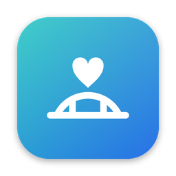
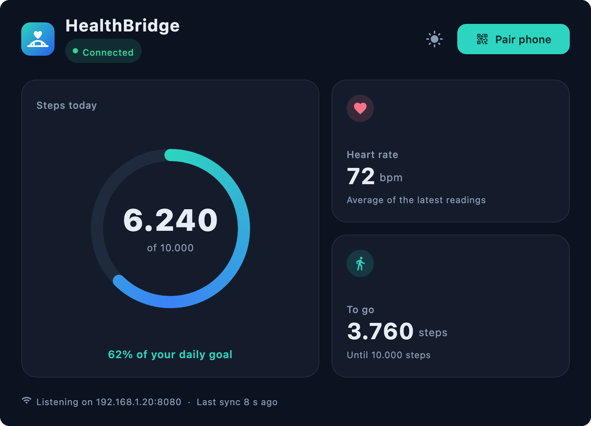
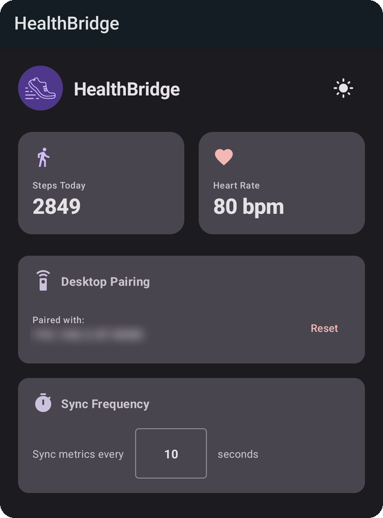
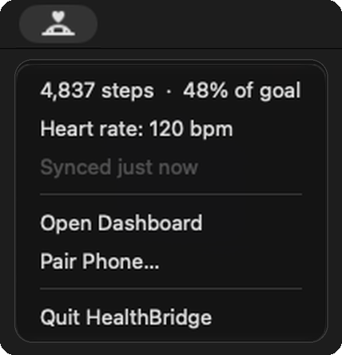
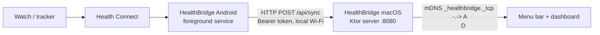

<p align="center"></p>

<h1 align="center">HealthBridge</h1>

**See your Android Health Connect stats on your Mac, without picking up your phone.**

HealthBridge pushes your daily steps and heart rate from Android's Health Connect to a small macOS menu bar app over your local Wi-Fi. No cloud, no account, no third-party server.

[](https://github.com/Intersebbtor/HealthBridge/releases/latest)


[](LICENSE)

<p align="center">
  
  &nbsp;
  
</p>
<p align="center">
  
</p>

## Why

I walk on a treadmill desk and wear my tracker on my ankle, so I can't glance at my wrist to see my steps. The numbers are already in Health Connect on my phone. HealthBridge just puts them where I'm already looking: the Mac menu bar.

## Features

- **Menu bar stats:** Today's steps, goal progress and heart rate in the macOS menu bar menu. The icon adapts to light and dark menu bars.
- **Dashboard window:** Step ring towards your daily goal (10,000 steps), heart rate, connection status and last sync time. Light and dark mode.
- **Background sync:** An Android foreground service pushes fresh values on an interval you choose (default: every 10 seconds).
- **Zero-config discovery:** The Android app finds the Mac on your network via mDNS. QR code pairing is available as a fallback.
- **Local only:** Data goes straight from phone to Mac over your LAN and is kept in memory only.

## How it works



1. The Mac app starts a small HTTP server on port `8080` and announces itself via mDNS.
2. The Android app discovers it (or you scan the QR code from the dashboard).
3. The Android app reads today's steps and recent heart rate from Health Connect and posts them to the Mac.

## Status

HealthBridge is an **early alpha** and a personal side project. It works for its main use case (steps on the Mac while walking), but expect rough edges. See [ROADMAP.md](ROADMAP.md) for the current state, known issues and what's next.

## Getting started

### Requirements

| | |
| :--- | :--- |
| **Android** | Android 8.0+ (API 26) with Health Connect. Built in on Android 14+, otherwise install the Health Connect app from the Play Store. |
| **macOS** | Apple Silicon Mac (the current build is arm64 only). |
| **Network** | Phone and Mac on the same Wi-Fi. Networks that block multicast or client-to-client traffic (guest Wi-Fi, some corporate networks) will not work. |

### Install

Download both files from the [latest release](https://github.com/Intersebbtor/HealthBridge/releases/latest).

**macOS**

1. Open `HealthBridge-macOS.dmg` and drag HealthBridge into Applications.
2. The app is not signed or notarized yet. If macOS refuses to open it, right-click the app and choose **Open**, or run:
   ```bash
   xattr -dr com.apple.quarantine /Applications/HealthBridge.app
   ```
3. Launch it. The HealthBridge icon appears in your menu bar and the dashboard opens.

**Android**

1. Install `HealthBridge-Android.apk` (allow installs from unknown sources when asked). The current APK is a debug build.
2. Open the app and grant the Health Connect permissions for **Steps** and **Heart rate**.
3. Allow notifications so the background sync can run as a foreground service.

### Pair

The Android app usually finds the Mac automatically. If it doesn't, click **Pair Device** in the Mac dashboard and scan the QR code with the Android app.

## Build from source

Requires JDK 17+ and the Android SDK (`local.properties` with `sdk.dir`).

```bash
# Run the desktop app
./gradlew :desktop:run

# Build the macOS DMG
./gradlew :desktop:packageDmg

# Build the Android APK
./gradlew :composeApp:assembleDebug

# Render dashboard previews to PNG (no window needed)
HEALTHBRIDGE_RENDER_PREVIEW=/tmp/hb-preview ./gradlew :desktop:run
```

## Project structure

| Path | Content |
| :--- | :--- |
| `composeApp/` | Android app (Kotlin, Jetpack Compose, Health Connect, CameraX + ML Kit for QR scanning) |
| `desktop/` | macOS app (Compose Multiplatform for Desktop, Ktor server, JmDNS, ZXing) |
| `tools/icons/` | Generator for all app, launcher and menu bar icons (`python3 tools/icons/generate_icons.py`, needs Pillow) |

## Privacy and security

- Health data never leaves your local network and is not stored on disk by the Mac app.
- The connection is plain HTTP inside your LAN, protected by a random token.
- **Known limitation:** The token is currently included in the mDNS announcement to make discovery zero-config. Anyone on the same network can read it. Only use HealthBridge on networks you trust. Fixing this is on the [roadmap](ROADMAP.md).

## Contributing

Bug reports, ideas and pull requests are welcome. Please open an [issue](https://github.com/Intersebbtor/HealthBridge/issues) first for bigger changes.

> Built by a single developer with a lot of help from AI coding assistants. Provided as is.

## License

[MIT](LICENSE)
